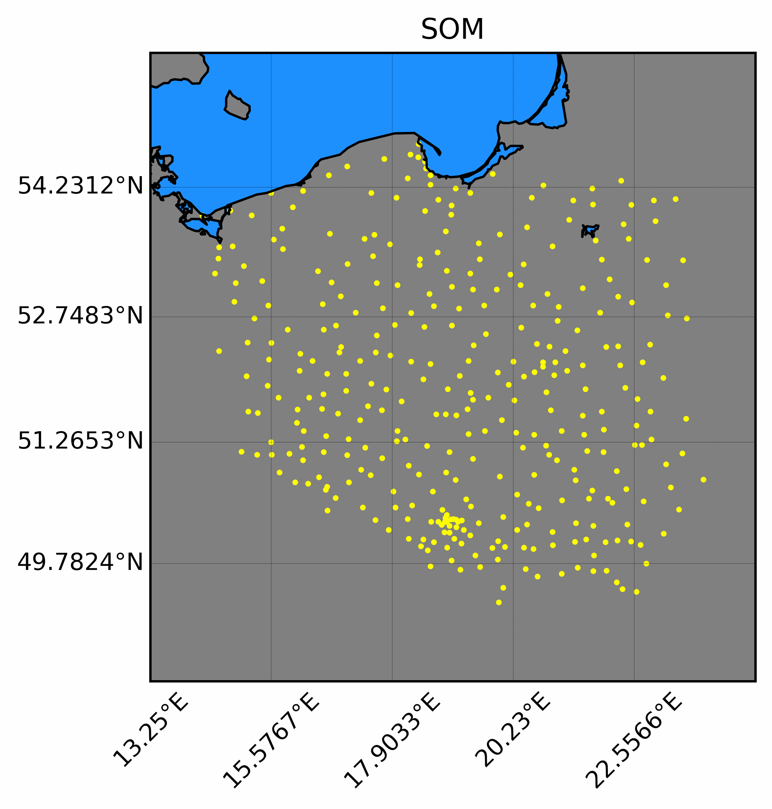
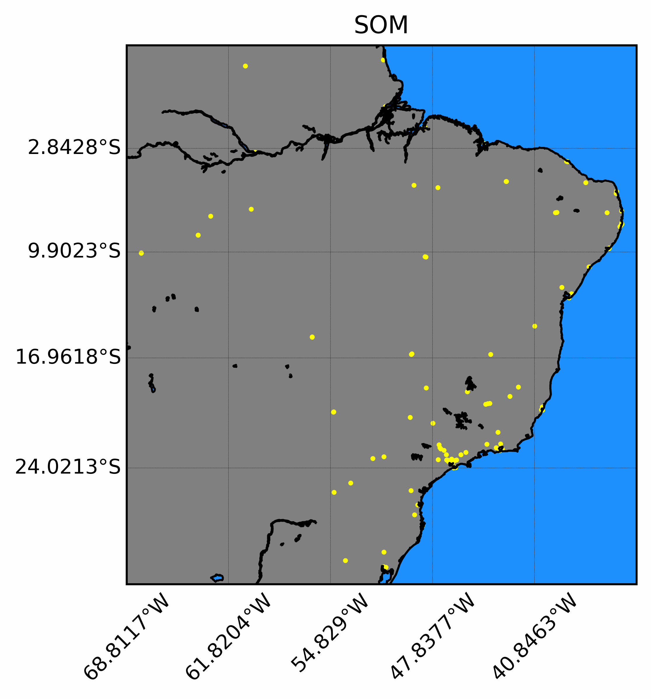

# Self organizing maps - Kohonen neural network
## First steps
```
$ python -m venv venv
$ ./venv/Scripts/activate.bat
$ pip install -r requirements.txt
$ python main.py
```
## TSP
Example results:
- USA 600 cities
<p align="center">

</p>
- Poland 340 cities 
<p align="center">

</p>
- Brazil 106 cities
<p align="center">

</p>

### Example data source
https://simplemaps.com/data/au-cities
